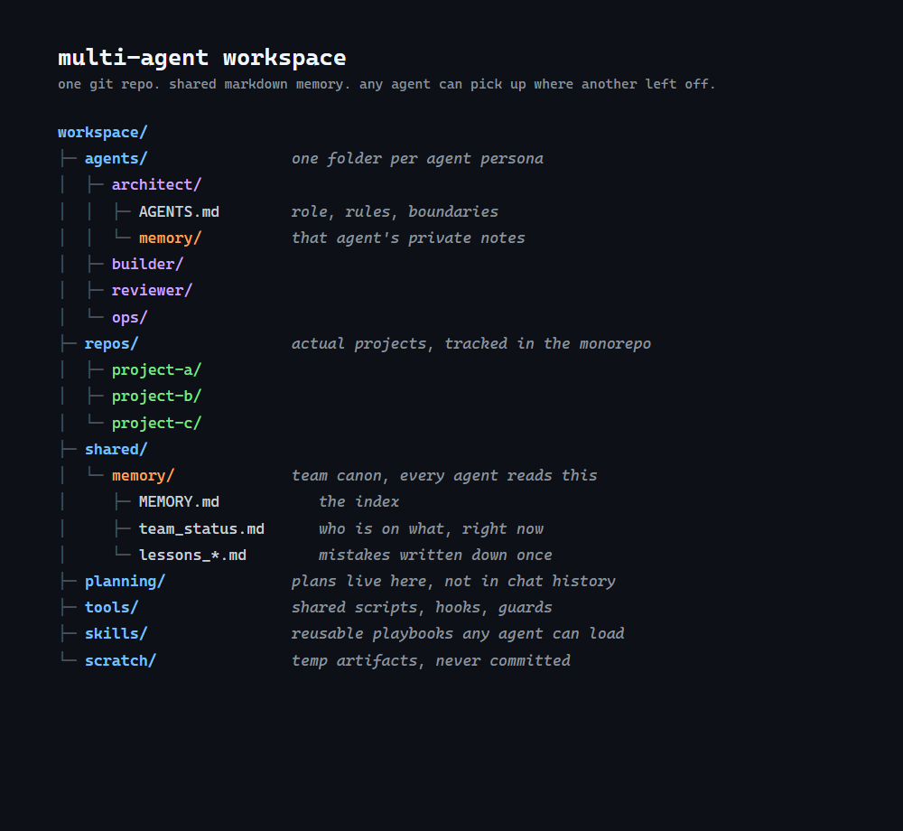

# Agent Workspace Bootstrap

One prompt that builds you a complete multi-agent AI workspace.

Paste [PROMPT.md](PROMPT.md) into a fresh Claude Code session and it becomes your setup guide. It interviews you one question at a time, explains every choice in plain English before you make it, and does the work itself as you go: folders, git, agent contracts, shared memory, GitHub wiring, skills, and a final dry run.

> **Before you run it:** this prompt builds a complete new monorepo workspace from scratch. It is not a tool for restructuring or migrating an existing repo. Run it in a fresh, empty folder, completely separate from any projects or repos you already have. It never needs to touch your existing work, and you should not point it at it.

## What you end up with

- One git repo holding everything: agents, projects, memory, plans, tools, skills.
- Named agents, each a folder with its own operating contract and private memory. Start a session from an agent's folder and that session becomes that agent.
- Shared markdown memory every agent reads on boot: a team status board, an index, and lesson files. Any agent can pick up where another left off.
- Handoffs as ready-to-copy prompts: one agent finishes, writes the board, and hands you the exact prompt to paste into the next agent's session.
- Guardrails baked in from day one: secrets never reach git, scratch stays out of the repo, and nothing is claimed done without verification.

Works with Claude Code, and with Codex through mirrored contract files.

## How to run it

1. Install [Claude Code](https://claude.com/claude-code) and sign in.
2. Open a session in any folder.
3. Paste the entire contents of [PROMPT.md](PROMPT.md).
4. Answer one question at a time. Say "default" whenever you want it to just pick sensibly.

Thirty to sixty minutes later you have a working workspace and know how to drive it.

## Why this shape

This is a cleaned-up copy of the workspace pattern we run every day at Broadside Code: a team of named agents with contracts, shared file-based memory, and prompt-based handoffs. The prompt carries none of our names or credentials, just the shape.

Questions or improvements: open an issue.
